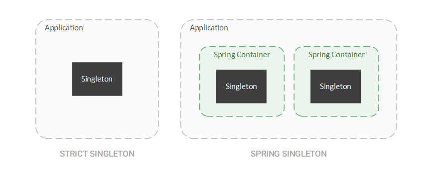
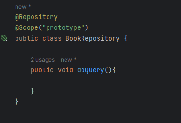

# Design Pattern trong Spring Framework
## 1. Singleton Pattern
- Không giống với Singleton Pattern trong một chương trình Java là chỉ có 1 thể hiện duy nhất của 1 class trong 1 ứng dụng
- Singleton Trong SpringFrameWork được hiểu là 1 SpringBean duy nhất trong 1 SpringContainer 
- Do vậy có thể hiểu là có nhiều object của 1 class có thể tồn tại trong 1 chương trình nếu như nó có nhiều containers



- Ví dụ : LibraryController và BookController đều inject BookRepository:
  + Khi in ra bookRepository thì đều trả về cùng 1 instance của BookRepository:
  ``` bash
     com.hunglp.spring_design_pattern.repository.BookRepository@5eefa415
     com.hunglp.spring_design_pattern.repository.BookRepository@5eefa415
  ```
  + Nếu dùng scope = prototype trên Class BookRepository thì sẽ trả ra 2 instance khác nhau của Repository
  
  ```bash
  com.hunglp.spring_design_pattern.repository.BookRepository@3359c978
  com.hunglp.spring_design_pattern.repository.BookRepository@7ba63fe5
  ```
## Factory Method Pattern

- Spring sử dụng Factory Method Pattern làm cốt lõi của Dependency Injection (DI)
- Spring định nghĩa interface "Bean Factory" là 1 container chứa các beans
- Mỗi phương thức getBean từ applicationContext được hiểu như là một factoryMethod, Factory này trả về bean theo tên hoặc tên class của Bean
- Ví dụ: 
  ```java
  BasicBean basicBean = applicationContext.getBean(BasicBean.class);
  System.out.println(basicBean);
  ```
- Ngoài việc get Beans từ Application Context này ra thì còn có thể đọc từ nhiều file ClassPathXmlApplicationContext
- Ví dụ :
  ```java
    
    ApplicationContext context_1 = new ClassPathXmlApplicationContext("context_1.xml");
    ApplicationContext context_2 = new ClassPathXmlApplicationContext("context_2.xml");
  ```
